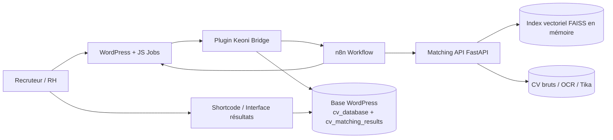
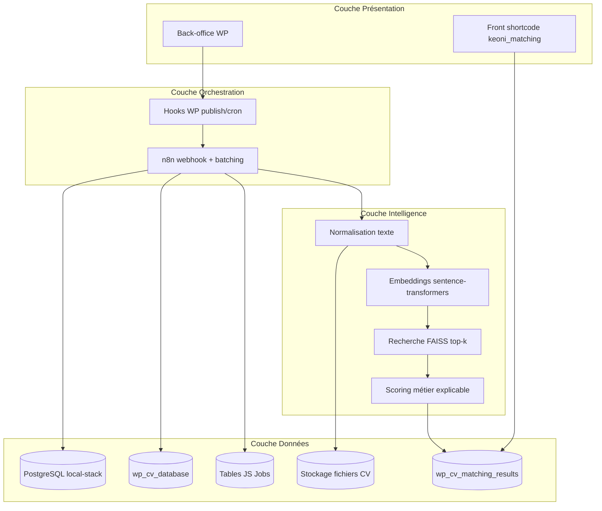
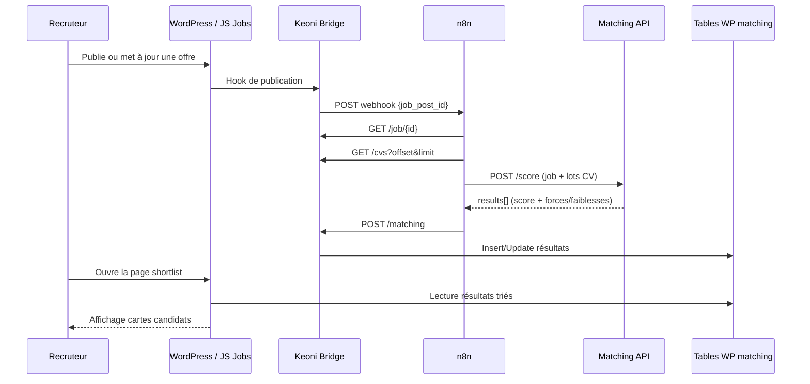
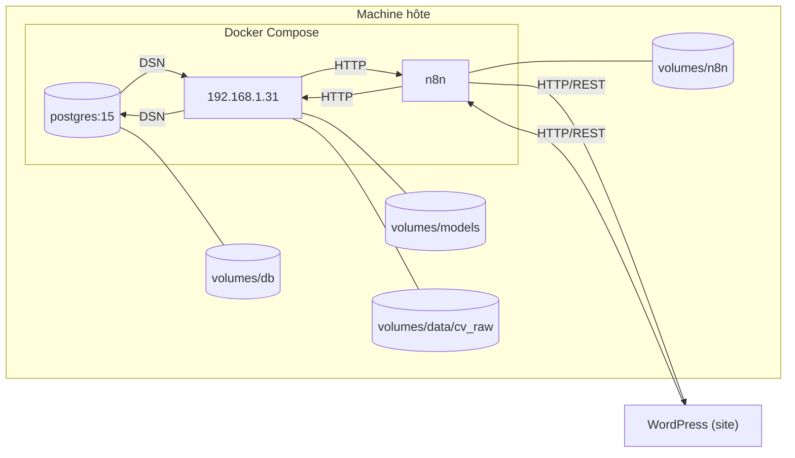

# Documentation complète du projet Keoni IA Matching

## 1) Résumé exécutif
Ce projet met en place une chaîne complète de matching CV ↔ offres d’emploi pour un site WordPress basé sur JS Jobs Manager.

La solution est composée de 4 briques principales :
1. **WordPress + plugin bridge (`keoni-bridge`)** : expose les données, stocke les résultats, déclenche les traitements.
2. **n8n** : orchestre le workflow de bout en bout.
3. **API Python (`192.168.1.31`)** : calcule les scores IA (embeddings + FAISS + règles métier).
4. **PostgreSQL** : persistance locale de la stack (n8n + API). Côté WordPress, les tables du plugin sont créées dans la base WP.

Objectif métier : réduire le temps de présélection, améliorer la pertinence des profils proposés et garder le contrôle des données (auto-hébergement).

---

## 2) Périmètre du repository

## 2.1 Arborescence utile
- `js-jobs/` : plugin job board principal (source fonctionnelle RH existante).
- `keoni-bridge/` : plugin custom d’intégration WordPress ↔ n8n ↔ API scoring.
- `local-stack/` : environnement Docker local (Postgres, 192.168.1.31, n8n + workflow JSON).
- `stack_auto_heberge.md` : vision fonctionnelle/architecture cible.
- `update-n8n.js` : script utilitaire de mise à jour d’un workflow n8n exporté.

## 2.2 Rôle de chaque dossier
- **`js-jobs/`** : gère offres, CV, candidatures, pages front et back-office RH.
- **`keoni-bridge/`** : ajoute les endpoints REST, les tables de matching, les hooks de déclenchement, les écrans admin et le shortcode d’affichage.
- **`local-stack/`** : permet exécution locale complète sans dépendance cloud.

---

## 3) Architecture technique

## 3.1 Vue d’ensemble
1. Une offre est publiée/modifiée dans WordPress (JS Jobs).
2. Le plugin `keoni-bridge` déclenche un webhook vers n8n.
3. n8n récupère l’offre et les CV via l’API REST WordPress (`X-API-Key`).
4. n8n prépare des lots et appelle l’API Python `/score`.
5. L’API Python retourne des scores + explications.
6. n8n poste les résultats vers WordPress (`/matching`).
7. Le shortcode `keoni_matching` affiche les candidats triés par score.

## 3.2 Composants
- **WordPress**
  - plugin métier : `js-jobs`
  - plugin bridge : `keoni-bridge`
- **n8n**
  - webhook d’entrée
  - pipeline de normalisation/chunking/scoring/persistance
- **Matching API (FastAPI)**
  - extraction texte (Tika + OCR images)
  - embeddings (`sentence-transformers`)
  - recherche similarité (FAISS)
  - score final métier (0-100)
- **PostgreSQL**
  - utilisé par la stack locale (n8n + API)

## 3.3 Architecture des briques (vue macro)

## 3.4 Architecture logique (couches)

## 3.5 Architecture des flux (séquence E2E)

## 3.6 Architecture de déploiement (local-stack)

> Note: ces schémas Mermaid sont directement visualisables dans VS Code (preview Markdown) et peuvent être exportés en PNG/SVG pour produire des images de documentation.

---

## 4) Stack et dépendances

## 4.1 Docker local
Fichier : `local-stack/docker-compose.yml`

Services :
- `db` : `postgres:15-alpine`
- `192.168.1.31` : build local `local-stack/services/192.168.1.31`
- `n8n` : `n8nio/n8n:latest`

Volumes :
- `local-stack/volumes/db`
- `local-stack/volumes/models`
- `local-stack/volumes/data/cv_raw`
- `local-stack/volumes/n8n`

Ports exposés :
- Postgres : `5433:5432`
- Matching API : `8000:8000`
- n8n : `5678:5678`

## 4.2 Variables d’environnement
Exemple : `local-stack/.env.example`

Variables clés :
- `POSTGRES_USER`, `POSTGRES_PASSWORD`, `POSTGRES_DB`
- `MATCHING_API_KEY`
- `WP_API_KEY`
- `N8N_BASIC_AUTH_USER`, `N8N_BASIC_AUTH_PASSWORD`
- `N8N_ENCRYPTION_KEY`
- `N8N_WEBHOOK_SECRET`
- `N8N_WEBHOOK_URL`
- `TIMEZONE`

## 4.3 Matching API (Python)
- FastAPI + Uvicorn
- Sentence Transformers
- FAISS CPU
- Apache Tika
- Tesseract OCR
- Pillow / NumPy / SciPy

Dockerfile installe aussi Java runtime (nécessaire à Tika) et utilitaires OCR/PDF.

---

## 5) Plugin WordPress `keoni-bridge`

## 5.1 Entrée plugin
Fichier principal : `keoni-bridge/keoni-bridge.php`

Fonctions clés :
- validation version PHP minimale (8.0)
- activation / désactivation / uninstall
- bootstrap des classes du plugin

## 5.2 Classes principales
- `Keoni_Bridge` : container principal, settings, vérification API key.
- `Keoni_Bridge_Install` : création des tables custom et seed configuration.
- `Keoni_Bridge_Rest` : endpoints REST WordPress.
- `Keoni_Bridge_Hooks` : hooks publication + cron + AJAX actions.
- `Keoni_Bridge_Repository` : accès SQL centralisé.
- `Keoni_Bridge_Admin` : pages d’administration.
- `Keoni_Bridge_Shortcode` : rendu front (`[keoni_matching]`) + “load more”.

## 5.3 Tables custom
Créées à l’activation :

### `wp_cv_database`
- `id`
- `candidate_email` (unique)
- `application_title`
- `file_name`
- `file_path`
- `text_content`
- `metadata` (JSON texte)
- timestamps

### `wp_cv_matching_results`
- `id`
- `job_id`
- `cv_id`
- `score`
- `strengths`, `weaknesses`, `keywords`, `extra`
- timestamps
- index sur `job_id` et `cv_id`

## 5.4 Endpoints REST exposés
Namespace : `/wp-json/keoni/v1`

### Endpoints protégés (`X-API-Key`)
- `GET /job/{id}` : retourne offre normalisée.
- `GET /cvs?offset=&limit=` : retourne CV paginés.
- `POST /cv` : insert/update CV parsé.
- `GET /cv/{id}` : détail CV.
- `POST /matching` : persist résultats de scoring.

### Endpoint lecture résultats
- `GET /matching/{job_id}` : résultats paginés (min_score, limit, offset).
- Peut aussi retourner du HTML (`with_html`), utilisé pour affichage.

## 5.5 Hooks et automatisation
- Publication post : planifie un trigger matching.
- Cron toutes 5 minutes : scan des offres JS Jobs modifiées.
- AJAX admin :
  - lancer matching
  - statut matching
  - réinitialiser résultats

## 5.6 Interface admin
Menus :
- Paramètres
- CV Database
- Matching Results

Paramètres :
- webhook n8n
- URL matching API
- secret webhook
- rôles autorisés CV DB
- régénération clé API

## 5.7 Shortcode front
Shortcode : `[keoni_matching job_id="..."]`

Fonctions front :
- cartes candidats triées par score
- affichage forces/faiblesses/mots-clés
- bouton “Afficher plus” (AJAX)
- bouton “Réinitialiser les résultats IA”

Assets :
- CSS : `keoni-bridge/assets/css/keoni-matching.css`
- JS : `keoni-bridge/assets/js/keoni-matching.js`

---

## 6) Workflow n8n
Fichier : `local-stack/n8n-matching-workflow.json`

## 6.1 Déclencheur
- Webhook `POST /keoni/new-job`
- Réponse immédiate JSON `{ "status": "received" }`

## 6.2 Chaîne de nœuds
1. **New Job** (Webhook)
2. **Fetch All CVs**
   - récupère job + CVs via API WP
   - filtre minimum de texte exploitable
   - chunking des CV
3. **Normalize Job + CV**
   - normalise structure payload
4. **Split Batches**
   - batch size configuré (100)
5. **Build Batch Payload**
6. **Score Batch**
   - call `192.168.1.31 /score`
7. **Store Results**
   - POST des scores vers WP `/matching`
8. Boucle vers `Split Batches` jusqu’à épuisement

## 6.3 Contrat de données
Entrée webhook attendue :
- `job_post_id` (obligatoire)

Sortie scoring attendue :
- `job_id`
- `results[]` avec :
  - `cv_id`
  - `score`
  - `strengths[]`
  - `weaknesses[]`
  - `keywords[]`
  - `extra{}`

---

## 7) Matching API (FastAPI)

## 7.1 Endpoints
- `GET /health`
- `POST /score` (protégé par `MATCHING_API_KEY`)

## 7.2 Préparation des données
- Agrégation de texte CV depuis plusieurs champs (`text_content`, `resume`, `skills`, metadata, etc.)
- Fallback extraction fichier via Tika/OCR si texte absent
- Tokenisation + stopwords
- Parsing mots-clés

## 7.3 Moteur de scoring
1. Embedding de l’offre + embeddings CV
2. Similarité cosinus via FAISS (IndexFlatIP + vecteurs normalisés)
3. Score métier final :
   - base similarité vectorielle
   - bonus mots-clés
   - bonus proximité titre
   - bonus localisation
   - clamp entre 0 et 100

Forme actuelle :
- `score = min(100, similarity*70 + keyword_hits*keyword_weight + title_bonus + location_bonus)`

## 7.4 Variables de tuning
- `MATCHING_TOP_K`
- `MATCHING_MIN_SIMILARITY`
- `MATCHING_KEYWORD_WEIGHT`
- `MATCHING_TITLE_WEIGHT`
- `MATCHING_LOCATION_WEIGHT`
- `EMBED_BATCH_SIZE`
- `SENTENCE_MODEL`

---

## 8) Flux E2E détaillé

1. Recruteur publie une offre (JS Jobs).
2. Hook WP appelle n8n webhook avec `job_post_id`.
3. n8n appelle `GET /job/{id}` et `GET /cvs`.
4. n8n prépare lots de CV.
5. n8n appelle `POST /score` sur 192.168.1.31.
6. 192.168.1.31 retourne liste ordonnée de scores.
7. n8n appelle `POST /matching` côté WP.
8. Front/back affichent les résultats persistés.

---

## 9) Installation et démarrage local

## 9.1 Prérequis
- Docker + Docker Compose
- WordPress opérationnel avec JS Jobs
- Plugin `keoni-bridge` installé/activé

## 9.2 Étapes
1. Copier `local-stack/.env.example` vers `.env`.
2. Renseigner toutes les secrets/URLs.
3. Démarrer la stack Docker locale.
4. Importer le workflow n8n `n8n-matching-workflow.json`.
5. Configurer les clés/API dans le plugin WordPress.
6. Tester un déclenchement manuel depuis une offre.

## 9.3 Vérifications minimales
- `/health` répond `status=ok`.
- Le webhook n8n est joignable depuis WordPress.
- Les endpoints WP `/job`, `/cvs`, `/matching` répondent avec la clé API.
- Les cartes front shortcode affichent des candidats.

---

## 10) Sécurité (état et recommandations)

## 10.1 Bonnes pratiques déjà en place
- API key hashée côté WordPress (`wp_check_password`).
- API key obligatoire côté FastAPI.

## 10.2 Points à corriger prioritairement
1. **Ne pas laisser les secrets dans le JSON n8n** (API keys en clair).
2. **Restreindre l’accès au endpoint `/matching/{job_id}`** si données sensibles.
3. **Limiter l’exposition des emails candidats en front public**.
4. **Activer HTTPS partout** (WP, n8n, API).
5. **Durcir Docker** (version pinning, pas de `latest` en prod).

## 10.3 RGPD / conformité
- définir durée de conservation CV/résultats
- implémenter purge/effacement sur demande
- tracer l’accès aux données RH
- chiffrer sauvegardes et secrets

---

## 11) Performance et scalabilité

Le projet est conçu pour monter en charge via :
- pagination des CV (`offset/limit`)
- batching n8n
- vectorisation efficace (FAISS)
- cache modèle sentence-transformers

Optimisations possibles :
- pré-calcul embeddings CV avec invalidation incrémentale
- file d’attente asynchrone pour jobs volumineux
- index SQL supplémentaires selon filtres métiers

---

## 12) Observabilité et exploitation

## 12.1 Logs utiles
- logs n8n (erreurs nodes, retries)
- logs FastAPI (timeouts, parse failures)
- logs WordPress/PHP (`error_log` sur webhook)

## 12.2 Indicateurs recommandés
- temps moyen scoring par lot
- taux d’échec parsing CV
- taux de jobs sans résultat
- top causes d’échec (auth, réseau, payload)

## 12.3 Sauvegarde
- base WordPress (tables natives + custom bridge)
- volumes Docker (`n8n`, `db`, `models`, `data`)
- export workflow n8n versionné

---

## 13) Qualité, tests et validation

## 13.1 Tests fonctionnels
- publication offre => trigger workflow
- récupération CV paginée
- scoring sur lot de CV réalistes
- persistance résultats en base
- rendu shortcode et pagination

## 13.2 Cas limites à valider
- CV sans texte exploitable
- offres sans mots-clés
- erreurs API key
- timeout 192.168.1.31
- relance idempotente du même job

## 13.3 Critères d’acceptation
- pipeline complet sans intervention manuelle
- résultats triés cohérents métier
- écran recruteur lisible et actionnable

---

## 14) Runbook d’incident rapide

## 14.1 “Aucun résultat IA affiché”
- vérifier webhook n8n reçu
- vérifier `POST /score` réussi
- vérifier `POST /matching` réussi
- vérifier `job_id` shortcode

## 14.2 “Erreur 401 API”
- comparer clés entre WP / n8n / 192.168.1.31
- vérifier header `X-API-Key`

## 14.3 “Scores trop faibles ou incohérents”
- ajuster `MATCHING_MIN_SIMILARITY`
- ajuster poids keywords/titre/localisation
- nettoyer texte CV/source

## 14.4 “Performance lente”
- réduire batch n8n
- limiter `top_k`
- prétraiter CV OCR coûteux hors flux synchrone

---

## 15) Gouvernance du code

## 15.1 Convention recommandée
- versionner tout changement workflow n8n (export JSON)
- séparer configuration et secrets
- documenter chaque changement de scoring

## 15.2 Versioning
- plugin bridge versionné (`0.1.0` actuellement)
- API matching versionnée (`0.2.0` actuellement)

---

## 16) Roadmap proposée

## Court terme
- sécurisation endpoints et secrets
- index SQL d’unicité matching (`job_id`, `cv_id`)
- politique de rétention CV

## Moyen terme
- embeddings persistés par CV
- monitoring métriques (dashboard)
- score explicable enrichi (sections CV, expériences clés)

## Long terme
- ranking hybride (vectoriel + règles métier avancées)
- multi-langue enrichie
- tests automatiques E2E CI/CD

---

## 17) Annexes

## 17.1 Fichiers de référence
- `stack_auto_heberge.md`
- `local-stack/docker-compose.yml`
- `local-stack/n8n-matching-workflow.json`
- `local-stack/services/192.168.1.31/app/main.py`
- `keoni-bridge/includes/class-keoni-bridge-rest.php`
- `keoni-bridge/includes/class-keoni-bridge-hooks.php`
- `keoni-bridge/includes/class-keoni-bridge-repository.php`
- `keoni-bridge/includes/class-keoni-bridge-shortcode.php`

## 17.2 Glossaire
- **Embedding** : représentation vectorielle d’un texte.
- **FAISS** : moteur de recherche de similarité vectorielle.
- **Top-k** : nombre maximum de CV retenus après recherche vectorielle.
- **Webhook** : endpoint HTTP déclenchant un traitement automatique.

---

## 18) Conclusion
Le projet est techniquement robuste, déjà structuré et proche d’un niveau production sur l’aspect fonctionnel.

Les priorités pour une mise en production sereine sont surtout la **sécurité des secrets**, le **durcissement des accès API**, et la **gouvernance des données candidates**.

Une fois ces points consolidés, la plateforme offre une base solide et évolutive pour un matching RH IA auto-hébergé.
