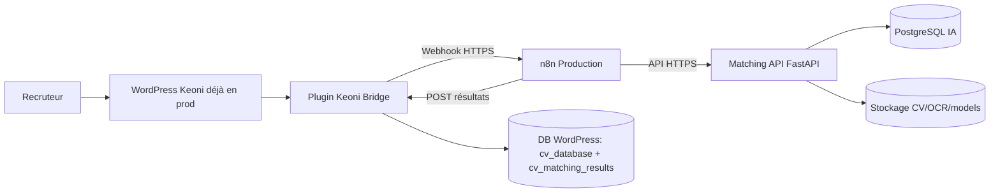
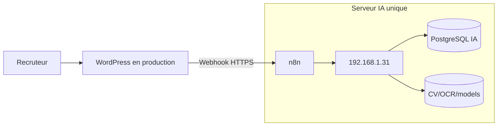
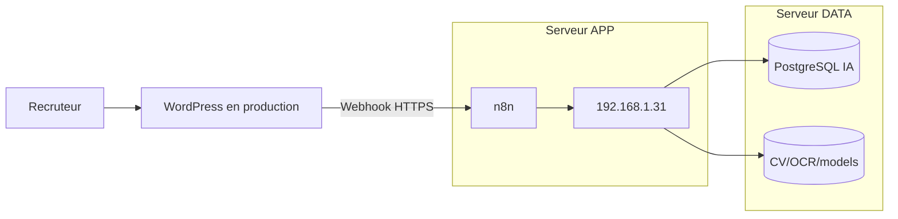

# Document des besoins de déploiement — Keoni IA Matching

## 1) Objet
Ce document liste **ce qu’il faut réunir** pour déployer la brique IA Keoni en production, sans détailler une procédure d’exécution.

---

## 2) Périmètre

### Existant
- WordPress Keoni en production
- Plugin JS Jobs Manager en production

### Composants requis pour la brique IA
- Plugin `keoni-bridge`
- Service `n8n` (orchestration)
- Service `192.168.1.31` (FastAPI)
- Base PostgreSQL dédiée IA
- Reverse proxy HTTPS
- Dispositif de logs, sauvegardes et alertes

---

## 3) Architecture cible (référence)

### 3.1 Option A — Architecture 1 serveur (simple)

Usage recommandé: démarrage rapide, charge modérée, coût réduit.

### 3.2 Option B — Architecture 2 serveurs (robuste)

Usage recommandé: charge élevée, meilleure isolation, montée en charge plus propre.

### 3.3 Choix entre les deux options
- Option A (1 serveur): plus simple, moins cher, mais SPOF plus marqué.
- Option B (2 serveurs): plus fiable, meilleure isolation base/données, mais coût et complexité supérieurs.
- Décision conseillée:
    - démarrage projet: Option A
    - passage en charge / production critique: Option B

---

## 4) Conditions techniques minimales

### 4.1 Infrastructure
- Linux LTS (Ubuntu recommandé)
- Docker + Docker Compose
- 4 vCPU minimum
- 8 Go RAM minimum (16 Go recommandé)
- 120 Go SSD minimum

### 4.2 Réseau et sécurité d’accès
- DNS opérationnel pour `n8n` et `matching`
- TLS valide sur tous les endpoints
- Pare-feu actif
- Accès SSH restreint

### 4.3 Accès opérationnels
- Accès admin WordPress
- Accès serveur (SSH)
- Accès aux secrets (coffre-fort recommandé)

---

## 5) Données de configuration nécessaires

### 5.1 Secrets et variables
- `POSTGRES_USER`
- `POSTGRES_PASSWORD`
- `POSTGRES_DB`
- `MATCHING_API_KEY`
- `WP_API_KEY`
- `N8N_BASIC_AUTH_USER`
- `N8N_BASIC_AUTH_PASSWORD`
- `N8N_ENCRYPTION_KEY`
- `N8N_WEBHOOK_SECRET`
- `N8N_WEBHOOK_URL`
- `TIMEZONE`

### 5.2 Paramètres IA initiaux
- `MATCHING_TOP_K`
- `MATCHING_MIN_SIMILARITY`
- `EMBED_BATCH_SIZE`
- Taille des lots n8n

---

## 6) Éléments attendus côté plateforme
- Plugin `keoni-bridge` installé et actif
- Workflow n8n importé et actif
- `192.168.1.31` exposée et saine (`/health`)
- Connexion WordPress ↔ n8n ↔ API validée par clés API
- Tables WordPress `cv_database` et `cv_matching_results` présentes

---

## 7) Exigences sécurité et conformité
- Aucun secret en clair dans les exports workflow
- Validation `X-API-Key` active des deux côtés
- HTTPS obligatoire sur les flux
- Contrôle d’accès endpoints sensibles
- Politique de rétention CV/résultats définie
- Procédure d’effacement/anonymisation disponible (RGPD)

---

## 8) Exigences d’exploitation
- Journalisation disponible (n8n, API, proxy)
- Sauvegardes planifiées (WordPress, Postgres IA, volumes n8n/data/models)
- Test de restauration validé
- Alertes sur incidents (401, 5xx, timeout)

---

## 9) Critères de disponibilité au déploiement
Le déploiement peut être lancé uniquement si:
- les accès, secrets et URLs sont validés,
- les composants requis sont disponibles,
- l’architecture cible est conforme,
- les exigences sécurité/exploitation sont couvertes,
- les responsables technique et métier valident le Go.

---

## 10) Dossier minimum à fournir avant exécution
- Inventaire des composants et versions figées
- Inventaire des secrets et emplacements
- Schéma réseau + endpoints exposés
- Export workflow n8n versionné
- Plan de sauvegarde/restauration
- Plan de rollback

---

## 11) Résumé décisionnel
Pour faire le déploiement, il faut réunir 5 blocs: **infrastructure**, **accès/secrets**, **composants techniques**, **sécurité/conformité**, **exploitation**. 
Ce document sert de base de contrôle “prêt à déployer”.
