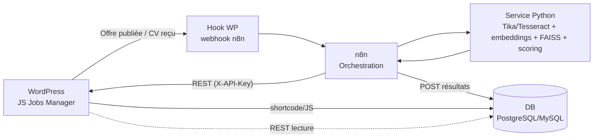
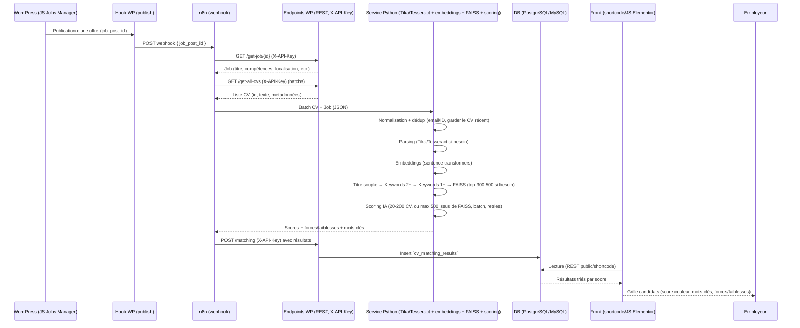
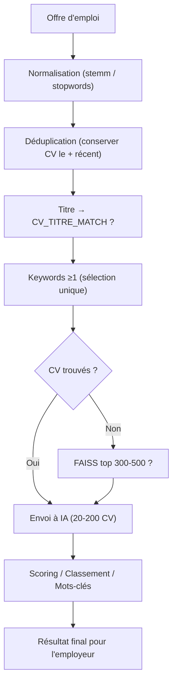

# Automatisation IA RH pour keoni-consulting.net (WordPress)

## Introduction
Ce document présente une solution d’automatisation IA pour le site WordPress RH keoni-consulting.net. Il met en lumière les limites du document initial, précise le contexte technique réel (plugins existants), fixe les objectifs métier et compare les options gratuites. Il détaille ensuite la stack auto-hébergée recommandée, son architecture, ses avantages/inconvénients et un plan de mise en œuvre pragmatique pour maîtriser les coûts et garder le contrôle sur les données.

## 1) Contexte et limites du document initial
- Le document initial décrit bien l’IA et un flux WordPress+n8n générique, mais **ne tient pas compte du contexte réel du site** (plugins JS Jobs Manager, Elementor, Ultimate Member) ni de la structure des données existantes.
- Il **suppose l’usage d’API payantes (OpenAI, SaaS CV)** sans proposer d’alternative 100% gratuite/auto-hébergée.
- Peu de détails sur la **sécurité (clé API, HTTPS, RGPD)** et la **gouvernance des données** (stockage des CV, suppression, logs).
- L’architecture front proposée repose sur un template custom, sans plan d’intégration **Elementor/shortcode** ni validation de compatibilité avec les plugins déjà en place.

## 2) Contexte WordPress actuel
- Site : keoni-consulting.net (RH).
- Plugins clés : JS Jobs Manager (job board), Elementor (+ Ultimate Addons), Ultimate Member (comptes/profils), Contact Form 7, WP Image CAPTCHA, WPvivid Backup, etc.
- Besoin : automatiser le parsing/matching des CV avec les offres, afficher les scores aux recruteurs/candidats, **sans dépendance SaaS payante**.

## 3) Objectifs
- Automatiser l’analyse des CV reçus (PDF/DOCX, parfois scannés) et leur **matching sémantique** avec les offres existantes.
- Réduire le temps de présélection, améliorer la qualité des recommandations, **limiter les coûts récurrents** (solution auto-hébergée et gratuite).
- Intégrer proprement dans WordPress/JS Jobs Manager : endpoints, stockage, affichage (Elementor/shortcode), sécurité (clé API, HTTPS).
- Assurer la traçabilité et la possibilité de réexécuter le matching sans retraiter tous les documents à chaque fois.

## 4) Solutions possibles (gratuites)
- **A. Règles + TF-IDF/Fuzzy** : très simple, rapide, mais peu sémantique (risque de faux négatifs si le vocabulaire diffère).
- **B. Embeddings open-source + FAISS (recommandé)** : matching sémantique robuste, coûts nuls en licence, contrôle total des règles métier.
- **C. LLM local (ollama/llama.cpp)** pour résumés/points forts : possible mais nécessite une machine costaude ; optionnel.

## 5) Stack recommandée (gratuite & auto-hébergée)
- **n8n self-hosté (Docker)** : orchestrer les workflows (déclenchement à chaque nouvelle offre/CV, batchs, monitoring, retries).
- **Micro-service Python** :
  - Parsing : Apache Tika (texte PDF/DOCX), Tesseract si scans.
  - Embeddings : `sentence-transformers` (ex. `all-MiniLM-L6-v2`) pour CV et offres.
  - Index : FAISS pour rechercher rapidement les CV les plus proches d’une offre.
  - Scoring : combinaison similarité embeddings + règles (compétences clés, localisation, langues, années d’XP) → score 0–100 + mots-clés trouvés.
- **Plugin WordPress custom** :
  - Endpoints REST sécurisés par clé (`X-API-Key`) pour exposer offres/CV et recevoir les résultats.
  - Tables : `cv_database` (CV parsés) et `cv_matching_results` (scores, forces/faiblesses, mots-clés).
  - Hook de déclenchement à la publication d’une offre (appelle le webhook n8n).
  - Shortcode/JS pour afficher, dans Elementor, une grille de candidats triés par score (badge couleur, mots-clés, forces/faiblesses, liens CV/mailto).
- **Base de données** : PostgreSQL ou MySQL (au choix selon hébergement) pour stocker CV, offres, résultats.

### Illustration (flux d’architecture)

## 6) Architecture (vue d’ensemble)
1. **WordPress (JS Jobs Manager)** : création d’offre → hook de publication déclenché.
2. **Hook WP (publish)** → appelle le **webhook n8n** avec `job_post_id`.
3. **n8n** : récupère l’offre et les CV depuis WordPress (REST, `X-API-Key`), en batchs.
4. **Pipeline matching (n8n + service Python)** :
  - Normalisation (minuscules, accents, stemming, stopwords techniques).
  - Déduplication par email/ID (garder le CV le plus récent).
  - Titre : match souple (>= 1 mot important).
  - Keywords : d’abord 2+ en commun, puis 1+.
  - Si rien : FAISS (top 300–500 sur embeddings pré-calculés).
  - IA/LLM : scoring final sur 20–200 CV (ou max 500 issus de FAISS), batch 50–100, timeouts + retries.
5. **n8n** POST les résultats vers WP `/matching` → insertion en DB (`cv_matching_results`).
6. **Front (employeur)** : shortcode/JS Elementor lit `cv_matching_results` et affiche les CV triés par score (mots-clés, forces/faiblesses).

### 6.1) Workflow n8n (validation rapide)

| Étape | Entrée | Traitement | Sortie | Gestion des erreurs |
| --- | --- | --- | --- | --- |
| Webhook | `job_post_id` (JSON) | Validation payload | 200 (ack) | 4xx si payload invalide, log n8n |
| GET Job | Header `X-API-Key` → WP `/get-job/{id}` | Récup job + champs | 200 + JSON job | 401/403 si clé invalide, 404 si job absent, log & stop |
| GET CVs | Header `X-API-Key` → WP `/get-all-cvs` | Récup liste CV (batchs) | 200 + array CV | 401/403/5xx → log, stop ; retry optionnel côté n8n |
| Scoring Python | Batch CV + job | Parsing (Tika/Tesseract), embeddings, FAISS, règles | 200 + JSON scores (score, forces, faiblesses, mots-clés) | Timeout (ex. 60s) → retry 1-2 fois ; si échec, marquer job “error” |
| POST résultats | Header `X-API-Key` → WP `/matching` | Écrit `cv_matching_results` | 200 + nb inserts | 401/403/5xx → log WP/n8n, notifier et marquer job “error” |
| Front | Lecture DB via shortcode/REST public | Affiche grille triée | UI (scores, mots-clés) | Message “aucun résultat” si vide ; cacher faiblesses si score < seuil |

### 6.2) Illustration complète du workflow

### 6.3) Illustration simplifiée (version client non technique)

*Légende rapide : on nettoie et déduplique les CV, on filtre par Titre puis on applique une seule sélection Keywords (≥1). Si rien, FAISS propose les plus proches. L’IA classe ensuite les meilleurs CV pour affichage.*

### LOGIQUE FINALE DE MATCHING DES CV

#### Étape 0 — Préparation et normalisation
- Normalisation du texte : transformer titres et mots-clés en minuscules, supprimer accents/tirets/ponctuation.
- Appliquer stemming/lemmatisation pour regrouper les variantes d’un même mot.
- Retirer les stopwords techniques récurrents ("engineer", "developer", "expert", "senior", etc.).
- Préparer les données : offre (`title`, `metakeywords`) et CV (`application_title`, `keywords`, `skills`).

#### Étape 1 — Déduplication
- Identifier les CV partageant le même email (ou identifiant unique).
- Conserver uniquement le CV le plus récent pour chaque candidat et supprimer les doublons plus anciens.
- Résultat : `CV_CLEAN`.

#### Étape 2 — Filtre sur le titre (match souple)
- Comparer `title` (offre) ↔ `application_title` (CV) et retenir les profils avec ≥ 1 mot important commun.
- Résultat : `CV_TITRE_MATCH`.
- Branche A : `CV_TITRE_MATCH = 0` → passer directement aux keywords stricts.
- Branche B : `CV_TITRE_MATCH > 0` → garder ces CV et continuer d’élargir progressivement.

#### Étape 3 — Filtre sur keywords (sélection unique)
- Comparer `metakeywords` (offre) ↔ `keywords` / `skills` (CV) et ne faire **qu’une seule passe** en retenant tous les CV avec ≥ 1 mot-clé commun → `CV_KEYWORDS_MATCH`.
- Pondérer davantage les profils contenant ≥ 2 mots-clés (bonus dans le score), mais sans les extraire dans un flux séparé pour éviter les doublons.
- Résultat : `CV_KEYWORDS_MATCH` fusionne directement avec `CV_TITRE_MATCH` (liste unique).
- Si `CV_KEYWORDS_MATCH = 0`, on bascule vers le fallback FAISS.

#### Étape 4 — Fallback FAISS
- Si aucune sélection après les étapes 2 et 3, utiliser FAISS pour remonter les top_k (300–500) CV sur embeddings pré-calculés.
- Objectif : ne jamais envoyer toute la base à l’IA, uniquement un sous-ensemble pertinent.

#### Étape 5 — Envoi à l’IA / LLM
- Limiter le nombre de CV : 20–200 profils filtrés (ou 500 max si fallback FAISS).
- L’IA calcule le score de pertinence, le classement, les forces/faiblesses et les mots-clés mis en avant.

#### Étape 6 — Temps / Résilience (n8n)
- Traiter par batchs de 50–100 CV par appel IA.
- Définir un timeout par batch et réessayer automatiquement en cas d’échec (ex. 3 tentatives).
- En cas d’échec final, marquer le batch/CV en erreur pour suivi et reprise manuelle.

## 7) Avantages / Inconvénients
**Avantages**
- Coût : pas d’abonnement par CV ni d’API payante ; seul le coût du serveur.
- Contrôle et souveraineté : données conservées chez vous, règles métier ajustables.
- Qualité : embeddings sémantiques → meilleure tolérance au vocabulaire varié.
- Extensible : ajout de résumés, préqualifications, alertes, recherche sémantique.

**Inconvénients**
- Maintenance : mises à jour Docker/n8n, dépendances Python, sauvegardes DB.
- Infra : besoin d’un VPS/serveur (CPU/RAM) ; Tesseract peut être lent sur gros scans.
- Tuning : choix/poids des règles de scoring, nettoyage des données, surveillance des biais.
- Monitoring : mettre en place logs/alertes (n8n, service Python, base de données).

## 8) Plan de mise en œuvre (synthèse)
1) **Infra** : VPS + Docker ; containers n8n, service Python, DB (Postgres/MySQL).
2) **Plugin WP bridge** :
   - Tables `cv_database` / `cv_matching_results`.
   - Endpoints REST sécurisés + page de config (clé API, URL webhook).
   - Hook `publish` pour déclencher n8n.
3) **Service Python** : parsing (Tika/Tesseract), embeddings, FAISS, scoring JSON.
4) **Workflow n8n** : webhook → GET offres/CV → batch → call Python → POST résultats → logs/notifications.
5) **Front Elementor** : shortcode/JS pour afficher les résultats (grille, scores, filtres légers).
6) **Sécurité & RGPD** : HTTPS obligatoire, clés régénérables, politique de rétention/suppression des CV, sauvegardes régulières.

## 9) Points de vigilance
- **Sécurité** : forcer HTTPS, stocker la clé `X-API-Key` côté n8n, limiter l’accès aux endpoints sensibles.
- **Performance** : batchs dans n8n (ex. 5 CV), FAISS en mémoire, cache des embeddings.
- **Qualité des données** : scans mal OCRisés → prévoir un seuil d’échec et un fallback manuel.
- **UX** : ne pas afficher les faiblesses aux candidats (ou les masquer sous un certain score) ; privilégier une vue recruteur.

## 10) Prochaines étapes
- Valider l’option **embeddings + FAISS** comme cible principale.
- Choisir la DB (PostgreSQL de préférence) et préparer le VPS.
- Développer le **plugin WP bridge** (endpoints + tables + shortcode).
- Déployer le **service Python** (Docker) + FAISS + Tika/Tesseract.
- Créer le workflow **n8n** et tester E2E sur un lot de CV/offres internes.
- Mettre en place sauvegardes, HTTPS et rotation des clés.

## Conclusion
La stack auto-hébergée proposée (n8n + micro-service Python + plugin WP bridge + DB) offre un matching CV/offres robuste sans coût d’API ni dépendance SaaS. Elle respecte le contexte WordPress existant, sécurise les échanges via clés/HTTPS et reste extensible (résumés, préqualifications, recherche sémantique). En suivant le plan par étapes, l’équipe peut déployer rapidement une solution maîtrisée, évolutive et conforme aux exigences de confidentialité des données candidates.
