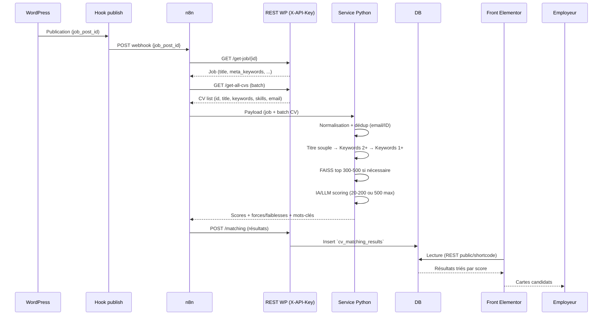

# Matching IA – Workflow Titre → Keywords → FAISS → IA

## Introduction
Ce document décrit la nouvelle logique de matching automatique entre les offres publiées sur keoni-consulting.net (WordPress + JS Jobs Manager) et la base de 32 000 CV. Il corrige les limites du premier document en intégrant un pipeline progressif (titre → mots-clés → FAISS → IA), des règles de normalisation/déduplication et une architecture auto-hébergée (n8n + micro-service Python + plugin WordPress bridge). L’objectif est d’obtenir un scoring pertinent sans jamais envoyer toute la base à l’IA, tout en gardant la maîtrise des données.

## 1) Limites du document initial
- Pas de prise en compte du volume réel (32k CV) ni d’une logique de filtrage progressive.
- Référence à des API payantes (OpenAI direct, SaaS CV) sans alternative gratuite/auto-hébergée.
- Absence de normalisation, déduplication et gestion de la résilience (batchs, timeouts, retry).
- Architecture front décrite sans tenir compte d’Elementor/JS Jobs Manager.

## 2) Contexte WordPress actuel
- Site : keoni-consulting.net (WordPress, JS Jobs Manager, Elementor, Ultimate Member, etc.).
- Besoin : proposer automatiquement aux employeurs les CV les plus pertinents lorsqu’une offre est publiée, sans dépendre d’un SaaS externe.
- Contraintes : 32k CV, multiples formats (PDF/DOCX), nécessité de rester auto-hébergé et RGPD-compliant.

## 3) Objectifs
1. Automatiser le matching en restant gratuit (stack auto-hébergée).
2. Limiter la charge : ne jamais envoyer les 32 000 CV à l’IA, mais un sous-ensemble filtré.
3. Offrir un scoring transparent (score + mots-clés + forces/faiblesses) et exploitable côté recruteur.
4. Garantir la résilience du workflow (batchs, timeouts, retries, journalisation).

## 4) Workflow logique (titre → keywords → FAISS → IA)
### Étape 0 – Préparation & normalisation
- Champs exploités :
  - Offre : `title`, `meta_keywords`, (option : extraire mots techniques de `description`).
  - CV : `application_title`, `keywords`, `skills`.
- Normalisation : minuscules, suppression accents/ponctuation, split sur -,/,:, suppression stopwords techniques ("engineer", "developer", "expert", …), stemming/lemmatisation.

### Étape 1 – Déduplication
- Identifier les CV ayant le même email (ou identifiant unique).
- Conserver uniquement la version la plus récente (règle imposée même si l’on ne purge pas les autres cas).
- Résultat : `CV_CLEAN`.

### Étape 2 – Filtre sur le titre (match souple)
- Comparer `title` (offre) ↔ `application_title` (CV) après normalisation.
- Condition : retenir un CV si ≥ 1 mot important du titre de l’offre apparaît dans le titre du CV.
- Résultat : `CV_TITRE_MATCH`.
- Branches :
  - **Branche A (0 résultat)** : passer aux mots-clés stricts (2+).
  - **Branche B (>0 résultat)** : conserver ces CV puis élargir avec les mots-clés.

### Étape 3 – Filtre sur keywords
Comparer `meta_keywords` ↔ `keywords` / `skills`.
1. **Niveau 2 mots-clés (step 3.1)**
   - Résultat : `CV_KEYWORDS_2_PLUS`.
   - Branche A : si >0 on les garde, sinon on passe au niveau 1 mot-clé.
   - Branche B : on ajoute ces CV (sans doublons) au set issu du titre.
2. **Niveau 1 mot-clé (step 3.2)**
   - Résultat : `CV_KEYWORDS_1_PLUS`.
   - Branche A : si >0 on garde, sinon fallback FAISS.
   - Branche B : on ajoute à l’ensemble existant.

### Étape 4 – Fallback FAISS
- Si, après les étapes 2 & 3, aucun CV n’est trouvé :
  - Utiliser FAISS (embeddings pré-calculés) pour récupérer les top_k 300–500 CV les plus proches de l’offre.
  - But : ne jamais envoyer l’intégralité de la base à l’IA.

### Étape 5 – IA / LLM (scoring final)
- Volume :
  - Cas normal (titre/keywords) : 20–200 CV.
  - Cas fallback FAISS : max 500 CV.
- L’IA reçoit : l’offre + chaque CV (texte + métadonnées) et renvoie score, classement, forces/faiblesses, mots-clés.

### Étape 6 – Temps & résilience
- Batch IA : 50–100 CV par appel pour respecter les limites et réduire les timeouts.
- Timeout : chaque batch a un délai max (ex. 60 s).
- Retry : jusqu’à 3 tentatives avant marquage "error".
- Logging : n8n consigne chaque étape (webhook, GET, scoring, POST).

### Résumé schématique
```
Offre publiée
   │
   ▼
Normalisation + déduplication (email/ID → CV récent)
   │
   ▼
Filtre Titre (≥1 mot important ?) ── oui → garder
   │                                       │
   └── non → Keywords (2+ communs ?) ── oui → garder
             │
             └── non → Keywords (1+ communs ?) ── oui → garder
                       │
                       └── non → FAISS top 300–500

Ensemble obtenu → IA (20–200 CV ou max 500 via FAISS) → Scoring + classement → Résultat affiché au recruteur
```

## 5) Architecture technique (auto-hébergée)
1. **WordPress** : JS Jobs Manager (offres/CV), plugin bridge (endpoints REST sécurisés `X-API-Key`, tables `cv_database` & `cv_matching_results`, hook `publish_job_posting`).
2. **n8n self-hosté (Docker)** : orchestre le workflow (webhook, fetch WP, batch, appel Python, POST résultats, logs).
3. **Micro-service Python** : normalisation, dédup, parsing (Tika/Tesseract), embeddings (`sentence-transformers`), FAISS, scoring IA (LLM open-source ou API privée).
4. **Base PostgreSQL/MySQL** : stocke CV parsés et résultats.
5. **Front Elementor** : shortcode/JS lisant `cv_matching_results`, affichage cartes candidats (score couleur, mots-clés, forces/faiblesses, liens CV/mailto).

## 6) Diagrammes
### 6.1 Flowchart (vision non technique)
```mermaid
flowchart TD
  A[Offre publiée] --> B[Normalisation + dédup]
  B --> C{Titre (≥1 mot ?)}
  C -->|Oui| H[Set candidats]
  C -->|Non| D{Keywords 2+}
  H --> I{Keywords 2+}
  D -->|Oui| H
  D -->|Non| E{Keywords 1+}
  I -->|Oui| H
  I -->|Non| E
  E -->|Oui| H
  E -->|Non| F[FAISS top 300-500]
  F --> H
  H --> G[IA/LLM (20-200 CV ou 500 via FAISS)]
  G --> J[Scores + classement + explications]
  J --> K[Affichage recruteur]
```

### 6.2 Diagramme de séquence (détaillé)


## 7) Workflow n8n – tableau de validation
| Étape | Entrée | Traitement | Sortie | Gestion erreurs |
| --- | --- | --- | --- | --- |
| Webhook | `job_post_id` | Vérification payload | 200 ack | 4xx si payload invalide, log |
| GET Job | Header `X-API-Key` | `GET /get-job/{id}` | 200 + JSON job | 401/403/404 → log & stop |
| GET CVs | Header `X-API-Key` | `GET /get-all-cvs` (batch) | 200 + array CV | 401/403/5xx → retry optionnel, sinon stop |
| Batch scoring | Job + CV batch | Appel service Python (normalisation, dédup, filtres, FAISS, IA) | 200 + scores JSON | Timeout → retry (x3), sinon marquer job "error" |
| POST résultats | Header `X-API-Key` | `POST /matching` | 200 + nb inserts | 4xx/5xx → log WP/n8n, notifier, marquer "error" |
| Front | REST public ou shortcode | Affichage trié | UI (scores, tags) | Message "aucun résultat" si vide |

## 8) Résilience & performance
- **Batch IA** : 50–100 CV par appel pour tenir les SLAs.
- **Timeout** : 60 s/batch ; abort + retry automatique (jusqu’à 3 tentatives).
- **FAISS** : embeddings pré-calculés, index en RAM (top_k 300–500) pour limiter la charge.
- **Journalisation** : n8n + logs Python (filtres déclenchés, volume final, temps par étape).
- **Monitoring** : alertes sur erreurs webhook/POST, métriques (CV analysés, temps moyen, ratio fallback FAISS).

## 9) Plan de mise en œuvre
1. **Infra** : VPS + Docker (n8n, service Python, DB) + HTTPS.
2. **Plugin WP bridge** : tables, endpoints sécurisés (`X-API-Key`), page de config (clé API + URL webhook), hook publish.
3. **Micro-service Python** :
   - Docker image contenant Tika/Tesseract, sentence-transformers, FAISS.
   - Script de normalisation/dédup + pipeline titre/keywords/FAISS + client IA.
4. **GA embeddings/FAISS** : job pour pré-calculer embeddings CV et construire l’index.
5. **Workflow n8n** : config webhook → GET job → GET CVs (batch) → call Python → POST résultats → logs.
6. **Front Elementor** : shortcode/JS pour afficher les cartes matchées.
7. **Tests** : dataset pilote (ex. 50 offres / 500 CV) pour valider seuils (titre, keywords, top_k FAISS) et calibrer l’IA.
8. **Mise en prod** : activer hook publish + surveiller via n8n (Executions) et logs Python.

## Conclusion
La logique progressive Titre → Keywords → (FAISS) → IA permet de traiter efficacement 32 000 CV sans dépendre d’un SaaS externe ni surcharger l’IA. Couplée à n8n, au micro-service Python et au plugin WordPress bridge, elle fournit un scoring pertinent, résilient et maîtrisé (données, coûts, performances).